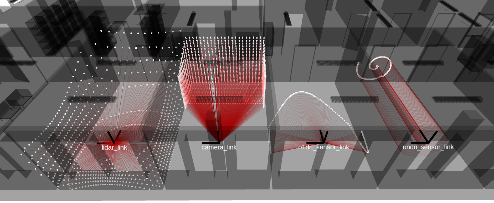

# rmagine_ros

Robots simulate their sensors in triangle meshes.

ROS integration of [rmagine](https://github.com/uos/rmagine) library and examples for:
- Basic usage of rmagine library
- Simulating different attributes for intersections
- Advanced examples to speed up your applications 

## Dependencies

- [rmagine](https://github.com/uos/rmagine) library (Required) for simulation
- [mesh_tools](https://github.com/uos/mesh_tools) (Optional) for visualization of loaded meshes in RViz

## Nodes

The node's arguments can be read in the example launch files.

### lidar_simulator
Simulate a lidar sensor.

### camera_simulator
Simulate a depth camera sensor.

### o1dn_simulator
Simulate a O1Dn sensor.

### ondn_simulator
Simulate a OnDn sensor.

